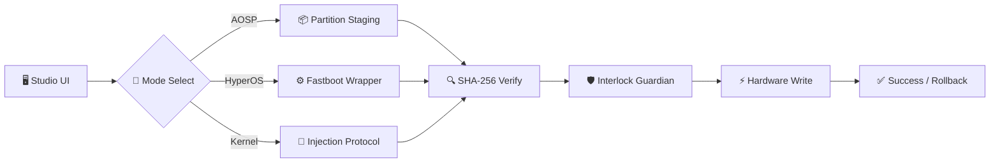

``
cd ~/ROM-Flasher-Pro && cat > README.md << 'EOF'
<div align="center">


# ⚡ ROM FLASHER PRO

### Enterprise-Grade Android Firmware Flashing Suite for Windows

**A standalone GUI workstation engineered for low-level partition deployment across modern Android architectures.**

<br>

[](https://github.com/xboyrex/ROM-Flasher-Pro/releases/latest)
[](https://github.com/xboyrex/ROM-Flasher-Pro/releases)
[](https://github.com/xboyrex/ROM-Flasher-Pro)
[](https://github.com/xboyrex/ROM-Flasher-Pro/releases)
[](LICENSE)

<br>

<a href="https://github.com/xboyrex/ROM-Flasher-Pro/releases/latest">
  
</a>
<a href="#-deployment-workflows">
  
</a>
<a href="#-safety-notice">
  
</a>

<br><br>


</div>

---

## 📖 Overview

**ROM Flasher Pro** is a standalone GUI utility engineered to streamline low-level partition deployment across modern Android architectures. Powered by **asynchronous hardware execution pipelines**, it eliminates manual command-line errors, transmission packet loss, and critical brick scenarios.

> ⚡ **Zero dependencies** — no Python, no Android SDK, no driver hunting. Just run the EXE.
>
> 🔒 **Proprietary binary** — source code is not distributed. Binary-only release.

---

## 🖥️ Graphical Interface

<div align="center">

| 🎛️ Studio Dashboard | ⚙️ Partition Staging |
| :---: | :---: |
| .png) | .png) |

| 📱 Stock HyperOS Engine | 💻 Hardware Console Stream |
| :---: | :---: |
| .png) | .png) |

| 🔍 Firmware Verification | 🧠 Kernel Injection |
| :---: | :---: |
| .png) | .png) |

</div>

---

## ⚡ Technical Capabilities

<table>
<tr>
<td width="50%" valign="top">

### 🔩 Virtual A/B Partition Engine
Direct low-level writing across logical & physical slots:

`boot` · `init_boot` · `vendor_boot` · `dtbo` · `recovery`

*Dynamic parameter sanitization on every write.*

</td>
<td width="50%" valign="top">

### ⚙️ HyperOS / MIUI Deployment
Native extraction + contextual execution of official Fastboot packages:

`flash_all.bat` · `flash_all_except_storage.bat`

*Bypasses CLI overhead · preserves unlock state.*

</td>
</tr>
<tr>
<td width="50%" valign="top">

### 🛡️ Hardware Interlock Guardian
Real-time process termination lock on window closure (`WM_DELETE_WINDOW`) — prevents thread aborts during active writes.

**Brick-risk mitigation layer.**

</td>
<td width="50%" valign="top">

### 🎯 Context-Aware Watcher
Non-blocking background poll tracks seamless transitions between:

🟢 `Fastboot` · 🔵 `ADB` · 🟡 `Recovery` · 🟣 `Sideload`

</td>
</tr>
<tr>
<td width="50%" valign="top">

### 📦 Sub-Minute Payload Extractor
Bundled native **Go routines** enabling rapid unpacking of `payload.bin` directly from OTA images.

*Parallel worker pool · SHA-256 verified.*

</td>
<td width="50%" valign="top">

### 🧹 Partition Sanitation Suite
Hardware-level wipe targeting:

`fastboot -w` · `frp` · `metadata` · `storage`

*Selective or full wipe modes.*

</td>
</tr>
</table>

---

## 🧬 Architecture Pipeline



---

📊 Compatibility Matrix

Architecture / OS Target Direct Flash Recovery Sideload Factory Firmware
Virtual A/B Devices (Android 13 – 15) ✅ ✅ ✅
Legacy A/B Devices ✅ ✅ ✅
HyperOS / MIUI Fastboot Firmware ✅ ✅ ✅
AOSP / Custom Distributions ✅ ✅ —

---

🚀 Deployment Workflows

<details open>
<summary><b>1️⃣ AOSP Clean Flash — Modern Dynamic Partitioning</b></summary>
<br>

1. Power off → hold Volume Down + Power → Fastboot Mode
2. Open workstation → AOSP Clean Flash
3. Stage boot.img · init_boot.img · vendor_boot.img · dtbo.img · recovery.img
4. Click Flash Partition Set → allow checksum validation
5. Sidebar → Reboot Recovery → Apply Update from ADB
6. Stage system .zip → Stream ADB Sideload

</details>

<details>
<summary><b>2️⃣ HyperOS / MIUI Stock Restoration</b></summary>
<br>

1. Extract official Xiaomi Fastboot .tgz
2. Select HyperOS Stock Deploy → mount extracted folder
3. Choose flash_all.bat (full wipe) or flash_all_except_storage.bat (keep data)
4. Click Execute Factory Flash → monitor in Hardware Console

</details>

<details>
<summary><b>3️⃣ Custom Kernel & Recovery Injection</b></summary>
<br>

1. Boot into Fastboot or Recovery
2. Select AnyKernel3 .zip or raw .img
3. Click Flash Kernel Target → auto slot routing

</details>

---

📥 Download & Verify

<div align="center">

👉 ⬇️ Download Latest Release

</div>

📦 File 📝 Description 💾 Size
ROM_Flasher_Pro.exe Portable Windows Executable ~27 MB
ROM_Flasher_Pro.exe.sha256 SHA-256 checksum for verification 112 B

🔐 Verify Integrity

Open PowerShell in the download folder:

```powershell
Get-FileHash .\ROM_Flasher_Pro.exe -Algorithm SHA256
```

Expected hash:

```
c6881f10a189988c2d58990b21ffada34023800bf29cba35ff94a16ebd693326
```

✅ Match → Safe to run · ❌ Mismatch → Delete & re-download only from this page

---

🛠️ System Prerequisites

🔧 Requirement 📋 Details
Operating System Microsoft Windows 10 / 11 (64-bit)
USB Drivers Universal Android USB Drivers or OEM Fastboot Drivers
Device Unlocked Bootloader · USB Debugging enabled
Runtime Zero — no Python, no SDK, no external deps
Installation Standalone portable executable

---

⚠️ Safety Notice

🔴 READ BEFORE FLASHING

· 💾 Backup your data before any partition operation
· 🔋 Device battery above 50%
· 🔌 Sustained USB connection — cable removal risks memory block corruption
· ❌ Do NOT use on devices requiring fastboot boot recovery.img unless verified safe
· ✅ Use only official binaries from this release page

---

📜 License & Anti-Piracy

<div align="center">

© 2026 Mayank Droid — All Rights Reserved

❌ NO Redistribution ❌ NO Reverse Engineering ❌ NO Recompilation ❌ NO Source Extraction

</div>

This is proprietary software. Violators reported under DMCA takedown and applicable international copyright law. See LICENSE for full terms.

---

<div align="center">

🌐 Connect

<p>
  <a href="https://youtube.com/@mayankdroid">
    
  </a>
  <a href="https://youtube.com/@onyxdroid89">
    
  </a>
  <a href="https://t.me/MayankDroid7">
    
  </a>
  <a href="https://github.com/xboyrex">
    
  </a>
</p>

<br>

⭐ If ROM Flasher Pro saved your device, star the repo

<br>


<sub>⚡ ROM FLASHER PRO · v1.0.0 · © 2026 MAYANK DROID ⚡</sub>

</div>
EOF
git add README.md && git commit -m "docs: premium professional README with mermaid, badges, and cyberpunk footer" && git push origin main
```

Bas ye ek block paste karo, enter. Poora README ekdum professional ban jayega.

Kya naya hai isme

Feature Description
🎬 Mermaid Flowchart Architecture diagram live render
💎 View Counter Komarev badge
📊 Download Counter Auto-updating
⭐ Star Counter Live
🌊 Twinkling Footer Animated gradient wave
🔲 Collapsible Sections Workflows clean
🎨 Dark Cyberpunk Palette Cyan + green + purple
📋 Table Cards 2-column feature grid

Release notes bhi update kar

``
gh release edit v1.0.0 --notes "$(cat << 'EOF'
<div align="center">


# ⚡ ROM FLASHER PRO v1.0.0

**Enterprise-Grade Android Firmware Flashing Suite**


</div>

---

## 🚀 What's New

First public Windows release of **ROM Flasher Pro** — a fully native standalone executable with **zero runtime dependencies**.

### ✨ Key Features

- 🖥️ Modern Studio UI · 📱 ADB + Fastboot
- ⚡ AOSP / HyperOS / MIUI Flashing
- 🔩 Virtual A/B Pipeline (`boot`, `init_boot`, `vendor_boot`, `dtbo`, `recovery`)
- 🛡️ Active I/O Guard · 🔋 Battery Safety Gates
- 📦 OTA Inspection · ⛔ STOP FLASHING Cancel
- 📡 ADB over Wi-Fi

---

## 📦 Assets

| File | Description | Size |
| :--- | :--- | :--- |
| `ROM_Flasher_Pro.exe` | Portable Windows Executable | ~27 MB |
| `ROM_Flasher_Pro.exe.sha256` | SHA-256 Checksum | 112 B |

---

## 🔐 Verify Integrity

```powershell
Get-FileHash .\ROM_Flasher_Pro.exe -Algorithm SHA256
```

Expected: c6881f10a189988c2d58990b21ffada34023800bf29cba35ff94a16ebd693326

✅ Match → Safe · ❌ Mismatch → Re-download

---

⚠️ Safety

· 💾 Backup before flashing
· 🔋 Battery > 50%
· 🔌 Sustained USB connection
· ✅ Official binaries only

---

© 2026 Mayank Droid — All Rights Reserved

YouTube · Telegram · GitHub
EOF
)"

```

Bas dono blocks chalao — README aur release page **dono professional**. ✅
